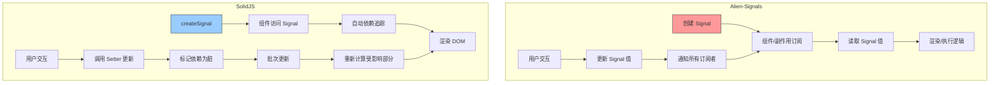
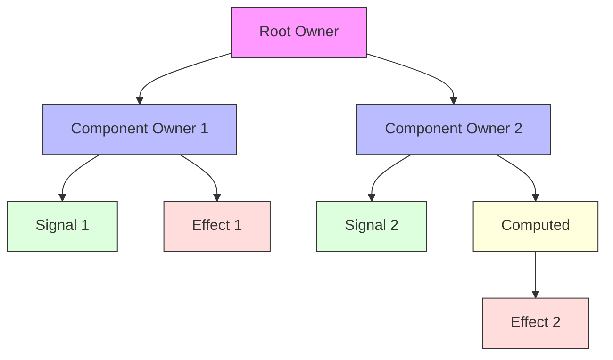
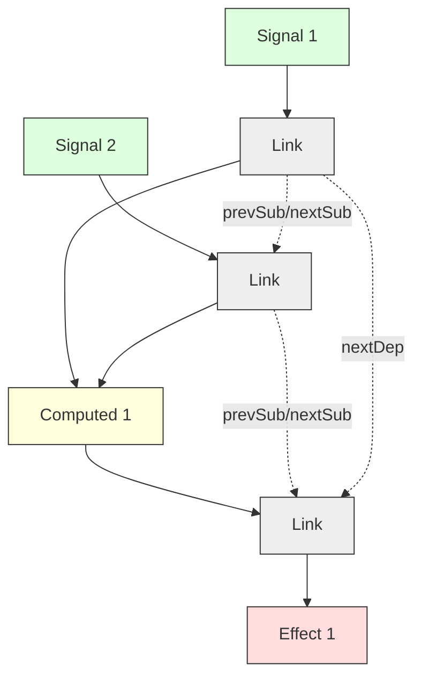
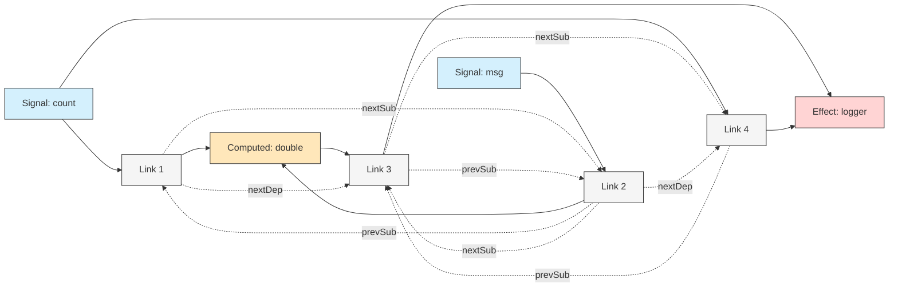
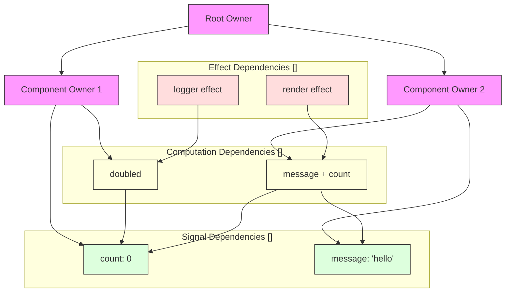
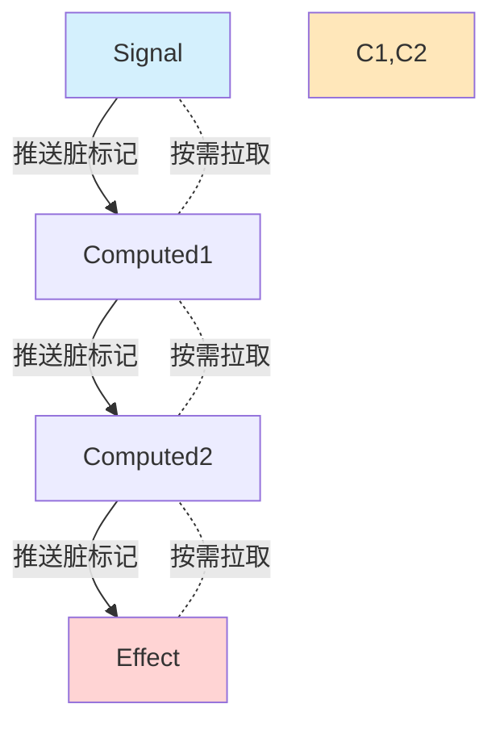
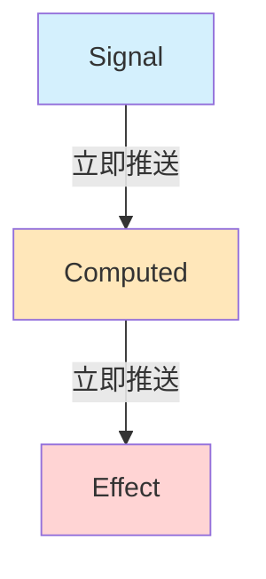
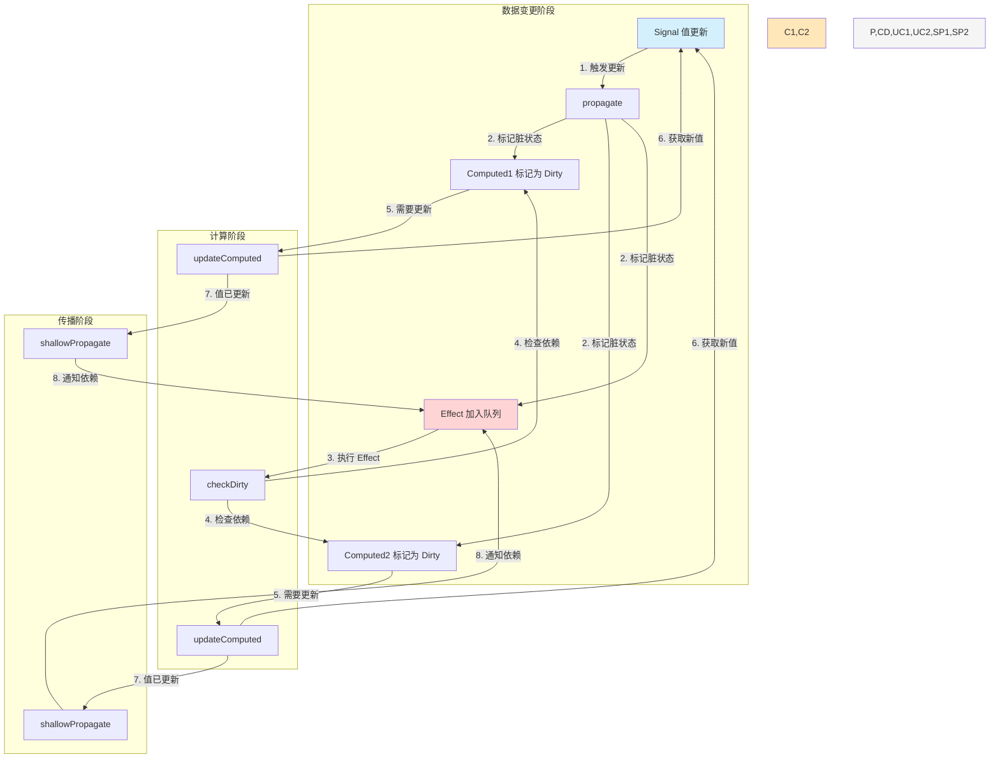
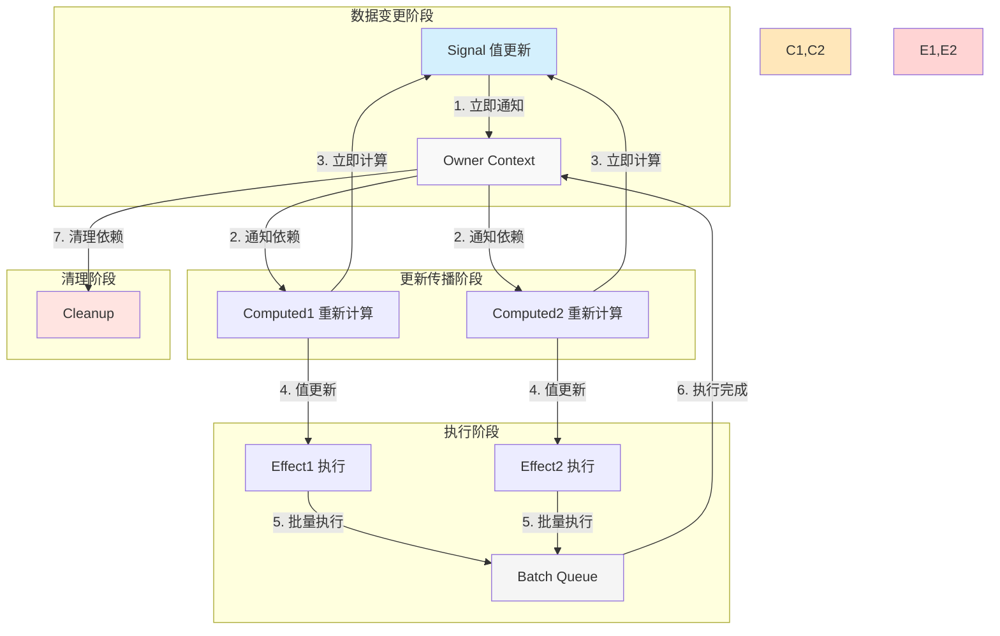

上篇文章主要是对尤雨溪在 2025 vue.js nation 大会的分享内容总结。分享中提到 vue3.6 将会使用 `alien-signals` 替换 `proxy` 响应式系统。

今天我们仔细盘盘 `alien-signals`。

### `alien-signals` 基本用法

`alien-signals` 是一个非常轻量级的响应式信号系统库，提供了标准的响应式三件套：`signal`、`computed`、`effect`。

基本的使用方法如下：

```ts
import { signal, computed, effect } from "alien-signals";
const count = signal(1);
const doubleCount = computed(() => count() * 2);
effect(() => {
  console.log(`Count is: ${count()}`);
}); // Console: Count is: 1
console.log(doubleCount()); // 2
count(2); // Console: Count is: 2
console.log(doubleCount()); // 4
```

### `alien-signals` 的底层原理

`alien-signals` 官方提到：该项目探索基于 `push-pull` 混合策略的信号算法。与其相似的框架还有：`vue3` `svelte`。

我们先来看看什么是 `push-pull` 策略。

### 为什么可以打败 `proxy` 响应式

### 和 `solid.js` 的 `signal` 谁更优秀？

说到这里，最先想到的一定是 `solid.js` 了，我很早以前就介绍过这个新兴的前端框架了。

它一直被公认为是标准的`signal`系统实现。所以，我就很想知道 `alien-signals` 的实现相较于 `solid.js` 的 `signal` 有啥不一样的地方吗？

经过我的这个周末的研究发现，`alien-signals` 确实做了极大的创新！



#### 1. 双向链表实现响应式

和 `solid.js` 通过发观察者模式不同，

















主要有三个核心接口：

1. **Dependency（依赖项）**

```typescript
interface Dependency {
  subs: Link | undefined;
  subsTail: Link | undefined;
}
```

2. **Subscriber（订阅者）**

```typescript
interface Subscriber {
  flags: SubscriberFlags;
  deps: Link | undefined;
  depsTail: Link | undefined;
}
```

3. **Link（链接）**

```typescript
interface Link {
  dep: Dependency | (Dependency & Subscriber);
  sub: Subscriber | (Dependency & Subscriber);
  prevSub: Link | undefined;
  nextSub: Link | undefined;
  nextDep: Link | undefined;
}
```

### 2. 核心特性

1. **双向链表结构**

- 使用 Link 结构构建了一个高效的双向链表系统
- 通过 prevSub 和 nextSub 维护订阅关系
- 通过 nextDep 维护依赖关系

2. **计算属性优化**
   从 <mcfile name="computed.spec.ts" path="/Users/bytedance/Documents/workSpace/alien-signals/tests/computed.spec.ts"></mcfile> 可以看出：

- 支持多层计算属性嵌套
- 实现了脏检查机制
- 采用惰性求值策略

3. **内存优化**
   从 <mcfile name="memoryUsage.mjs" path="/Users/bytedance/Documents/workSpace/alien-signals/benchs/memoryUsage.mjs"></mcfile> 的基准测试可以看出，该库在内存使用上非常高效。

### 3. 与 Vue 3.6 的关系

根据 README 中的信息：

1. 这个库的核心算法已经被移植到 Vue 3.6（PR: https://github.com/vuejs/core/pull/12349）
2. 作者在优化 Vue 3.4 的响应式系统时获得了大量经验
3. 相比 Vue 3.5 的 pull-based 算法，这个库采用了 push-pull 混合的实现

### 4. 主要优势

1. **性能优化**

- 使用双向链表而不是数组来存储依赖关系
- 实现了高效的脏检查机制
- 采用增量更新策略

2. **内存效率**

- 通过复用 Link 结构的字段减少内存占用
- 使用链表结构避免了数组扩容和收缩的开销

3. **可靠性**

- 完善的测试覆盖
- 已在 Vue 语言工具中得到实践验证

### 5. 使用场景

1. Vue 3.6+ 的响应式系统
2. Vue 语言工具中的虚拟代码生成
3. 需要高性能响应式系统的独立项目

这个库的设计非常精巧，特别是其链表结构和更新算法的实现，为 Vue 3.6 提供了更高效的响应式系统基础。

让我详细分析 alien-signals 中的双向链表结构及其特点：

### 1. 数据结构分析

alien-signals 的双向链表结构比较特殊，主要由三个部分组成：

```typescript
// 依赖项
interface Dependency {
  subs: Link | undefined; // 指向订阅者链表的头
  subsTail: Link | undefined; // 指向订阅者链表的尾
}

// 订阅者
interface Subscriber {
  flags: SubscriberFlags; // 状态标记
  deps: Link | undefined; // 指向依赖链表的头
  depsTail: Link | undefined; // 指向依赖链表的尾
}

// 链接节点
interface Link {
  dep: Dependency | (Dependency & Subscriber); // 依赖项引用
  sub: Subscriber | (Dependency & Subscriber); // 订阅者引用
  prevSub: Link | undefined; // 前一个订阅者
  nextSub: Link | undefined; // 下一个订阅者
  nextDep: Link | undefined; // 下一个依赖项
}
```

### 2. 与 React Fiber 的区别

1. **结构差异**

- React Fiber：单向链表结构，主要用于任务调度

  - child：指向第一个子节点
  - sibling：指向下一个兄弟节点
  - return：指向父节点

- alien-signals：双向多链表结构，用于依赖追踪
  - prevSub/nextSub：订阅者之间的双向链接
  - nextDep：依赖项之间的单向链接
  - dep/sub：跨链表的相互引用

2. **用途差异**

- React Fiber：用于中断和恢复渲染工作
- alien-signals：用于精确的依赖追踪和更新传播

3. **优化重点**

- React Fiber：优化大规模 UI 更新的调度
- alien-signals：优化依赖收集和更新传播的性能

### 3. 脏检查机制分析

alien-signals 的脏检查机制与 Angular 的确有一些相似之处，但实现方式和效率有很大差异：

1. **Angular 的脏检查**：

- 采用定期轮询检查
- 需要遍历所有绑定
- 比较新旧值是否相等
- 可能需要多轮检查直到稳定

2. **alien-signals 的脏检查**：

```typescript
function checkDirty(link: Link): boolean {
  // ... 省略部分代码 ...
  if ("flags" in dep) {
    const depFlags = dep.flags;
    if (
      (depFlags & (SubscriberFlags.Computed | SubscriberFlags.Dirty)) ===
      (SubscriberFlags.Computed | SubscriberFlags.Dirty)
    ) {
      if (updateComputed(dep)) {
        // 只在真正需要更新时传播
        if (subs.nextSub !== undefined) {
          shallowPropagate(subs);
        }
        dirty = true;
      }
    }
  }
  // ... 省略部分代码 ...
}
```

主要特点：

- **增量检查**：只检查被标记为脏的计算属性
- **精确传播**：通过链表结构精确定位需要更新的依赖
- **优化策略**：
  - 使用位运算进行状态检查
  - 采用 push-pull 混合策略
  - 避免不必要的重复计算

### 4. 性能优势

1. **内存效率**

- 链表结构避免了数组的内存开销
- 节点复用减少内存分配

2. **更新效率**

- 精确的依赖追踪
- 增量式更新
- 避免无效的脏检查

3. **可预测性**

- 确定性的更新传播路径
- 避免 Angular 式的多轮检查

这种实现方式特别适合 Vue 3.6 的响应式系统，因为它既保持了高性能，又维持了可预测的更新行为。相比 Angular 的脏检查机制，它更加精确和高效，而相比 React 的 Fiber 架构，它更专注于依赖管理而非任务调度。

```ts
// 基础类型定义
interface Dependency {
  subs: Link | undefined;
  subsTail: Link | undefined;
}

interface Subscriber {
  flags: number;
  deps: Link | undefined;
  depsTail: Link | undefined;
}

interface Link {
  dep: Dependency;
  sub: Subscriber;
  prevSub: Link | undefined;
  nextSub: Link | undefined;
  nextDep: Link | undefined;
}

// 标记位
const enum Flags {
  DIRTY = 1,
  COMPUTED = 2,
  PENDING = 4,
}

// 全局状态
let activeSubscriber: Subscriber | undefined;
let batchQueue: Set<Link> | undefined;

// 创建信号
function signal<T>(initialValue: T) {
  const dep: Dependency = {
    subs: undefined,
    subsTail: undefined,
  };

  let value = initialValue;

  return function signal(newValue?: T): T {
    if (arguments.length > 0) {
      if (value !== newValue) {
        value = newValue!;
        propagate(dep);
      }
      return value;
    }

    if (activeSubscriber) {
      link(dep, activeSubscriber);
    }
    return value;
  };
}

// 创建计算属性
function computed<T>(getter: () => T) {
  const dep: Dependency & Subscriber = {
    subs: undefined,
    subsTail: undefined,
    flags: Flags.COMPUTED,
    deps: undefined,
    depsTail: undefined,
  };

  let value: T;

  const signal = () => {
    if (dep.flags & (Flags.DIRTY | Flags.PENDING)) {
      updateComputed(dep, getter);
    }
    if (activeSubscriber) {
      link(dep, activeSubscriber);
    }
    return value;
  };

  dep.compute = () => {
    const prevSub = activeSubscriber;
    activeSubscriber = dep;
    try {
      const newValue = getter();
      if (value !== newValue) {
        value = newValue;
        return true;
      }
      return false;
    } finally {
      activeSubscriber = prevSub;
    }
  };

  return signal;
}

// 创建副作用
function effect(fn: () => void) {
  const sub: Subscriber = {
    flags: 0,
    deps: undefined,
    depsTail: undefined,
  };

  const run = () => {
    const prevSub = activeSubscriber;
    activeSubscriber = sub;
    cleanup(sub);
    try {
      fn();
    } finally {
      activeSubscriber = prevSub;
    }
  };

  run();
  return () => cleanup(sub);
}

// 依赖链接
function link(dep: Dependency, sub: Subscriber) {
  const link: Link = {
    dep,
    sub,
    prevSub: undefined,
    nextSub: undefined,
    nextDep: undefined,
  };

  // 连接依赖链表
  if (dep.subsTail) {
    dep.subsTail.nextSub = link;
    link.prevSub = dep.subsTail;
  } else {
    dep.subs = link;
  }
  dep.subsTail = link;

  // 连接订阅者链表
  if (sub.depsTail) {
    link.nextDep = sub.deps;
    sub.depsTail.nextDep = link;
  } else {
    sub.deps = link;
  }
  sub.depsTail = link;
}

// 更新传播
function propagate(dep: Dependency) {
  if (!batchQueue) {
    batchQueue = new Set();
  }

  let link = dep.subs;
  while (link) {
    const sub = link.sub;
    if (sub.flags & Flags.COMPUTED) {
      sub.flags |= Flags.DIRTY;
      propagate(sub);
    } else {
      batchQueue.add(link);
    }
    link = link.nextSub;
  }

  if (batchQueue && !activeSubscriber) {
    const queue = batchQueue;
    batchQueue = undefined;
    queue.forEach((link) => {
      if (link.sub.compute) {
        link.sub.compute();
      }
    });
  }
}

// 清理订阅
function cleanup(sub: Subscriber) {
  let link = sub.deps;
  while (link) {
    const nextDep = link.nextDep;
    const dep = link.dep;

    if (link.prevSub) {
      link.prevSub.nextSub = link.nextSub;
    } else {
      dep.subs = link.nextSub;
    }

    if (link.nextSub) {
      link.nextSub.prevSub = link.prevSub;
    } else {
      dep.subsTail = link.prevSub;
    }

    link = nextDep;
  }
  sub.deps = sub.depsTail = undefined;
}

export { signal, computed, effect };
```
